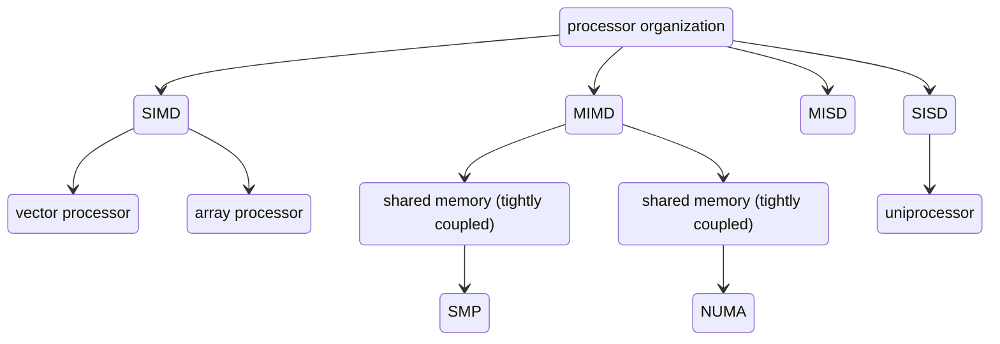

- [ref textbook: Computer Organization and Architecture 10th edition](http://home.ustc.edu.cn/~louwenqi/reference_books_tools/Computer%20Organization%20and%20Architecture%2010th%20-%20William%20Stallings.pdf)
- [ref textbook 8th edition solution manual](https://www.studocu.com/row/document/beijing-university-of-posts-and-telecommunications/computer/solution-manual-computer-organization-and-architecture-8th-edition/21390211)

# Lectures

## Lecture 1 Real-time System

- software
	- system program
		- software that interfaces with the hardware
		- example: drivers, interrupt handlers, task schedulers, compilers, assemblers, linkers, locators
		- operating system: specialized collection of system programs that manage physical resources of computer ^os
	- application programs
		- programmed to solve specific problems
- system
	- mapping of a set of inputs into a set of outputs
	- input & output
		- input: associated with sensors, convert analog signals into digital signals
		- output: converted to analog to control external hardware devices
	- ![[RTCSA notes-20231212-153.png]]
- definition of real-time system
	- a system that responds within specified times. (Not necessarily fast – must meet timing deadline)
- response time
	- time between the presentation of a set of inputs to a system and the realisation of the required behaviour
	- how fast? depends on specific system's characteristic and purpose
- real-time computing
	- study of system subjected to a "real-time constraint" (deadline)
	- logical correctness is based on both the correctness of the **outputs** and their **timeliness**
- failed system
	- cannot satisfy one or more of the requirements
- embedded system
	- perform dedicated functions, often with real-time computing constraints
	- system has a central role in the functionality of the system, but the system is not explicitly called a computer
	- hardware tightly coupled and software integrated that designed to dedicated function
	- embedded into a larger product, often hidden from view
	- encapsulated by the device it controls
	- can be sub-system within a larger system
	- one can have multiple embedded system coexist
- firmware
	- program instructions written for embedded systems
	- stored in read-only memory or Flash memory chips
	-  run with limited hardware resources
- reactive system
	- task scheduling is driven by ongoing interaction with their environment
- main requirement of an embedded system
	- environmental
	- performance
	- economic
	- consequential

### types of real-time system
1. *soft real-time system*
	1. performance is **degraded** but **not destroyed** by failure to meet response-time constraints
2. *firm real-time system*
	1. a few missed deadlines will not lead to total failure, but missing more than a few may lead to complete system failure
3. *hard real-time system*
	1. failure to meet even a single deadline may lead to complete system failure

### real-time punctuality
- cost-effective and robust real-time systems
	- process everything as slow as possible
	- repeat as less as possible
- real-time punctuality
	- response time has average $t_R$ and upper bound & lower bound $\varepsilon_{\mathrm{U}}$ and $\varepsilon_L$

### CPU Utilization Factor (U)
- or called time-loading factor, a relative measure of non-idle processing taking place
	- time-overloaded: U>100%
	- too tightly utilized: changes/addition/correction cannot be made
	- not sufficiently utilized: not cost-effective
- 50%: common for new product
- 80%: acceptable for system without growth
- 70%: best!
- how to calculate
	- $$ u_i=e_i/p_i$$
	  $$U = \sum u_i$$
	  $e_i$: execution time, $p_i$: execution period
- Event & Release time
	- event: occurrence that causes program to change non-sequentially
	- release time: time at which an instance of scheduled task is ready to run and is generally associated with an interrupt
- Synchronous vs Asynchronous Events
	- synchronous: occur at predictable times in the flow-of-control
	- asynchronous: occur at unpredictable points in the flow-of- control and are usually caused by external sources
- Deterministic System
	- each possible state and input will result in the same output
	- event determinism: next state and output of system are known for each set of input and events

## Lecture 2 Computer Number System

### binary digital system
- motivation
	- world analog
	- need to quantify, but not infinite precision
- binary data used to represent
	- number
	- character
	- instruction
	- logical
- radix system (base)
	- radix or base: defines a set of symbols used to represent number
	- radix point: reference point that determine the value of each digit
- Radix Representation
	- number: $d_{31}...d_1d_{0}$
	- value: ($d_{31}\times B^{31}+...+d_0 \times B^{0}$)
- conversions
	- binary to hex: 1 hex digit = 4 bits binary
	- ![[RTCSA notes-20231212-154.png]]
- interpretations of binary number
	- signed vs. unsigned
	- *unsigned*
		- N-bit unsigned integer: range $(0,2^N-1)_{10}$
	- *signed*
		- N-bit signed integer: range $(-2^{N-1},2^{N-1}-1)$
	- sign and magnitude
		- two's complement to represent a negative number
			1. invert digits (+28 = 00011100, invert: 11100011)
			2. add one to the result (11100011 + 1 = 11100100 = -28)
	- representation width
		- make sure to pad the original value to full representation width

### Floating point number
- motivation: relative accuracy is needed
- how does this work?
	- signifcand: contains number's digits, if negative: negative number
	- exponent: where the decimal or binary point is placed relative to the beginning of the sinificand

| signifcand | exponent | scientific notation | fixed-point value |
| ----------- | -------- | ------------------- | ----------------- |
| 1.5         | 4        | $1.5\times 10^4$    | 15000             |

- IEEE-754 Standard Floating Point
	- structure: (MSB) {sign-bit (1)}-{exponent (8)}-{significand (23)} (LSB)
	- ![[RTCSA notes-20231212-155.png]]
	- exponent: in bias -127 integer format (add 127 to it)
	- signifcand: only fractional part of the mantissa, MSB of mantissa is always 1 and not stored
	- example
		- -88 = $-2.75\times 2^5$, $2.75 = (10.11)_2 = (1.011)_2 \times 2$
		- exponent part: 6 (00000110) +127 (01111111) = 1000 0101
		- significand: 0110 0000 0000 0000 0000 000
		- sign: 1
- IEEE-754 Double Precision Format
	- structure: (MSB) {sign-bit (1)}-{exponent (11)}-{significand (52)}
	- exponent: in bias -1023 integer format (add 1023 to it)
	- signifcand: only fractional part of mantissa, MSB is always 1 and not stored.
- comparison of fixed & floating point
	- floating point
		- pro: large dynamic range, resolution determined by sinificand
		- con: implementation slow
	- fixed point
		- pro: implementation fast
		- con: limited range and resolution

### other representation
- character
	- ACSII code, 8-bit byte represent character
- character / string in C
	- how to represent a variable length string: use '\0' to mark ending
- gray code
	- a binary numbering system
	- characteristic: two successive values differ by 1 bit

## Lecture 3 Performance

### measure performance
- system clock
	- operations of processors are governed by system block
	- speed of processor is dictated by pulse frequency, unit: cycles per second or Hz
	- clock signal generated by quartz crystal, which generates a constant sine wave, converted into a digital voltage pulse stream
	- rate of pulses: clock rate or clock speed
		- clock rate is determined by the physical layout of the processor
	- operations are synchronized and paced so that proper signal values are available for each operation
	- most instructions require multiple clock cycles to complete
	- pipelining: multiple instructions executed simultaneously
	- direct comparison of system clock frequency will not show the performance.
- cycles per instruction (CPI)
	- $$ \tau=1/f$$
	  f: constant frequency, $\tau$: constant cycle time
	- instruction count $I_c$ : number of machine instruction executed for that program until it runs completion
	- CPI: average cycles per instruction
		- all instruction require same amount of clock cycles: CPI will be constant
		- $CPI_i$ : number of cycles required for instruction type i
		  $I_i$: number of executed
		- $CPI=\frac{\sum_{i=1}^n(CPI_i\times I_i)}{I_c}$
		- processor time $T = I_C \times CPI \times \tau$
		- refine $T$: some time is used during execution, some is used to transfer data from memory (determined by memory time)
			- $T = I_C \times [p + (m\times k)]\times \tau$
			- p: number of processor cycles
			- m: number of memory references
			- k: ratio between memory cycle time and processor cycle time
		- factors that influences T
			- instruction set design
			- compiler technology (if the compiler is effective enough to convert efficient machine language from a high-level program)
			- processor implementation
			- cache and memory hierarchy
		- ![[RTCSA notes-20231212-156.png|475]]
- Millions of Instructions per Second (MIPS)
	- $$ \text{MIPS rate}=\frac{I_c}{T\times10^6}=\frac{f}{CPI\times10^6}$$

## Lecture 4 Overview of an Operating System (OS)

### what is OS
- definition: program that manages all the other programs in a computer
	- other programs called applications
	- applications request for services through application program interface (API)
- OS performs as environmental architecture
	- for efficient usage
	- act as control program
- ![[RTCSA notes-20231212-157.png]]
- services of OS ^service-of-os
	1. multitasking
	2. manage memory sharing
	3. handle input and output
	4. send message
	5. offload batch job
	6. provide parallel processing
- OS provides abstraction of hardware
	- allow users to program without knowledge of hardware
- OS resources management
	- process management
	- memory management
	- time & space multiplexing

### OS component
- Process management
	- applications
	- allocate independent memory space for each process
	- creation and destruction of processes
	- schedule process according to their deadline, priority, sequence...
	- maintain communication of process
	- maintain concurrency of process
- Memory management
	- support multiprogramming
	- sharing data between processes
	- virtual memory: use secondary memory (RAM) as cache
- File system
	- abstraction of a bulk of information
- I/O
	- requires device specific knowledge
- Network
- Security
- GUI

### Operating System Structure
- monolithic
	- ![[RTCSA notes-20231212-158.png]]
	- single program includes all kernel code and offers all os services
	- system calls
	- fast and efficient
	- less portable, difficult to maintain
	- minor bug can crash whole system
	- traditional (Unix, Linux)
- microkernel
	- ![[RTCSA notes-20231212-159.png]]
	- simplify kernel design
	- user-space servers
	- rapid deployment, unit testing, easy maintenance
	- huge memory footprint
	- frequent context switching, and high inter-process communication
	- not easy to implement
- monolithic vs. microkernel
	- monolithic has better performance
	- microkernel has better modularity and extensibility
	- modern OS adopt hybrid approach

### Types of OS
- Network OS
	- for computer network
	- allow facilities file sharing and hardware access
	- more communication features compared with single computer OS
- Distributed Operating System
	- microkernel plus service component that coordinates with other nodes
	- work collectively to fulfil all system resources
	- single node has full access to all system resources
		- complicated scheduling and parallelism
		- user not aware of which node is executing
- RTOS
	- dedicated to meet specific timing constraints
	- key design requirement
		- predictability and determinism
		- speed (by simplified OS design)
		- responsiveness and user control
		- fail-safety
	- require advanced scheduling and memory allocation
	- vs. embedded OS (EOS)
		- interchangable in this course
	- RTOS on embedded system vs. Super Loop
		- Super loop: straightforward to implement, fit computational model of Embedded system
			- depends on lengthy interrupt service routine
			- needs to synchronization between interrupt service routine (ISR)
			- poor predictability
			- change of ISR will result in change of the whole system
		- RTOS
			- better program flow
			- multitasking
			- better communication and resource management

### processes
- process has:
	- CPU time allocation
	- memory
	- process ID
	- threads
- process can be aware of each other
- memory layout of an program
	- {stack} -> {unused} <- {heap} {data (uninitialized)} {data (initialized)} {code / text}
	- code / text
		- instruction
		- clone of program
		- read-only
		- program counter to the next instruction
	- static data
		- variables shared between threads
		- if not initialized: 0 or Null
	- heap
		- malloc/free
	- stack
		- used for procedure call for return
		- stack pointer
			- FILO
- abstraction of process
	- switch execution needs to keep context
		- memory state
		- CPU state
		- OS state
	- program: instructions stored on the disk
	- process: program with execution context ^diff-program-process
	- thread: lightweight process, a process can have multiple threads
- process control block (PCB) or Task Control Block (TCB)
	- contains all relevant information for the process
		- ID
		- state
		- registers
		- scheduling information
		- memory management information
		- accounting information
		- user information
- process creation
	- 3 ways
		- initialization
		- request of process
		- request of users
	- generate unique ID
	- allocate memory
	- initialize PCB and memory management
	- link PCB in the queue
- process termination
	- stopped by OS/users or terminate itself
	- handle the output
	- release resources and reclaim the memory
	- unlink PCB
	- many embedded software never terminate
- context switching
	- PCB makes this easier
		- scheduler will start/stop process accordingly
		- stores info to start/stop
			- register
			- program counter
			- memory state/stack/heap
			- state
		- load info from the PCB
	- context switching will consume time
		- can up to thousand CPU cycles
		- overhead and bottleneck
		- need hardware support
	- multiprogramming
- process state
	- standard model has 5 states
		1. *new*: just created, not ready for queue
		2. *ready*: can be loaded by OS
		3. *running*: scheduler picked this process from queue and executed it
		4. *blocked*: not in the queue, waiting
		5. *exit*: finished, needs to terminate
	- state information also recorded by PCB
	- context switching needed when processes leave/enter the running state
	- state transition may voluntarily (terminate) or involuntarily (error)
	- OS maintains queue or queue-like structure for process in the same state
- state transition
	- ![[RTCSA notes-20231212-160.png]]
	- *admit*: process is fully loaded into memory and control established
	- *dispatch*: scheduler begin to assign CPU to process
	- *time out*: expired/preempted, push back to queue
	- *event occur/wait*: request cannot be met now, has to wait until something occurs
		- why
			- OS not ready for survice
			- unavailable resources
			- wait for input
	- *release*: release resources and end the process

## Lecture 5 Computer Components and Function

### computer components
- von Neumann architecture
	- ![[RTCSA notes-20231212-161.png|325]]
	- data & instruction
		- stored in read-write memory
	- memory
		- addressable by location
	- execution
		- sequential fashion
- hardwired & micro-programmed
	- hardwired
		- fixed set of logic gates and circuit to execute instructions
		- control signals are *hardwired* into control unit, control unit has dedicated circuit for each possible instruction
		- simple and fast, inflexible
	- micro-programmed
		- control unit uses microcode to execute instructions
		- microcode: a set of instructions that can be modified/updated, allowing for greater flexibility
		- control signals for each instruction are generated by a micro-program stored in the memory
- hardware program
	- connect various components in the desired configuration
	- "program" is in the form of hardware
	- accept data and produce result
- software program
	- accept data and control signals then produce results
	- each step needs different set of control signals
- software
	- motivation
		- change/control through programming is easier than rewiring hardware
	- code is instructions, and hardware interpret each instruction to generate control signals
	- software = a sequence of codes/instructions
- programming in software
	- two major components of the system and constitute CPU
		- instruction interpreter
		- general-purpose arithmetic and logic functions
	- I/O components
		- input module
			- accept data and instructions
			- convert into internal form of signals
		- output module
			- report results
- computer components from top level view
	- ![[RTCSA notes-20231212-162.png|450]]
	- CPU
	- memory module: consist a set of locations, defined by sequentially numbered addresses
		- each location contains binary number that can be interpreted as data/instruction
	- I/O module: transfer data from/to external devices to CPU and memory
		- contains internal buffers for temporarily holding these data

### major components
- CPU
	- interpret instruction
	- arithmetic and logic functions
- I/O components
	- input module
		- accept data/instruction and convert into internal form of signals
	- output module
		- report results
- memory
	- definition: place to store temporarily both instruction and data
	- memory address register (MAR)
		- specify address in memory for the next read/write
	- memory buffer register (MBR)
		- contain data to be written into memory or receive data read from memory
	- I/O address register (I/O AR)
		- specify particular I/O device
	- I/O buffer register (I/O BR)
		- exchange data between I/O and CPU

- basic instruction cycle
	- processor does actual work by executing instructions specified in the program
	- two steps of instruction processing
		- ![[RTCSA notes-20231212-163.png]]
		1. read (fetch) instructions from memory
			- program counter (PC) holds address of instruction to be fetched next
			- processor increments PC after fetch
			- fetched instruction loaded into instruction register (IR)
		2. execute
			- categories of actions
				- processor-memory
					- transfer data between processor and memory
				- processor-I/O
					- transfer data between processor and I/O
				- data processing
					- perform arithmetic or logic operation on data
				- control
					- alter the sequence of execution
- Characteristics of a Hypothetical Machine
	- accumulator (AC): single data register
	- both instruction and data are 16-bit long, memory is then organized using 16-bit word
	- instruction format
		- {opcode (0-3)} - {address (4-15)}
	- example of program execution
		- ![[RTCSA notes-20231212-164.png|325]]
- ![[RTCSA notes-20231212-165.png|550]]
	- states
		- instruction address calculation (*IAC*): determine the address of next instruction to execute
		- instruction fetch (*IF*): read instruction from memory into processor
		- instruction operation decoding (*IOD*): analyze instruction to determine type of operation
		- operand address calculation (*OAC*): if involves reference ot operand in memory or I/O device, determine the address of operand
		- operand fetch (*OF*): fetch operand from memory or I/O
		- data operation (*DO*): perform operation indicated in the instruction
		- operand store (*OS*): write result into memory or I/O

### interrupt
- class of interrupts
	- definition: mechanism for other modules (I/O, memory) interrupt the normal processing of processors

| class of interrupts | description                                                                                                                    |
| ------------------- | ------------------------------------------------------------------------------------------------------------------------------ |
| program             | generated by some condition occurs as a result of instruction execution                                                        |
| timer               | generated by timer within processor, allow to perform functions in a regular basis                                             |
| I/O                 | generated by I/O controller, indicate completion of operation OR request service from processor OR variety of error conditions |
| hardware failure    | generated by failure                                                                                                                               |

- program timing
	- short I/O wait
		- ![[RTCSA notes-20231212-166.png|400]]
	- long I/O wait
		- ![[RTCSA notes-20231212-167.png|400]]
- transfer of control via interrupts
	- OS's responsibility to suspend the user program then resume it at the point interrupt is completed
- instruction cycle with interrupts
	- ![[RTCSA notes-20231212-168.png]]

## Lecture 6 Computer Interconnection

### Interconnect Structure
- 3 basic modules
	- processors
	- memory
	- I/O
- collection of paths for them to connect with each other: interconnection structure
- memory interconnection
	- ![[RTCSA notes-20231212-169.png|425]]
	- a memory contains N words of equal length
	- each word has its own numerical address
- I/O interconnection
	- ![[RTCSA notes-20231212-170.png|425]]
	- each port represent an external device
- CPU interconnection
	- ![[RTCSA notes-20231212-171.png|425]]

### Types of Transfers
- memory to processor
	- processor reads an instruction or data from memory
- processor to memory
	- processor writes data to memory
- I/O to processor
	- processor reads data from I/O via I/O module
- processor to I/O
	- processor sends data to I/O device
- I/O to/from memory
	- I/O module is allowed to directly exchange data with memory (direct memory access)

### Bus Interconnection
- what is bus
	- communication pathway connect devices
	- signal transmitted by any device are available for reception
		- if transmit at the same time: garbled (overlap)
- system bus
	- bus connects major computer components
- bus interconnection
	- ![[RTCSA notes-20231212-172.png|500]]
	- three groups of buses
		- data
		- address
		- control
- operation of bus
	- send data
		1. obtain use of bus
		2. transfer via bus
	- request data
		1. obtain use of bus
		2. transfer request via control and address bus
- data bus
	- move data among system modules
	- number of lines referred to as the width of data bus
	- width determines how many bits can be transferred at the same time
	- width is a key factor that determine the performance of the system
- address bus
	- designate the source/destination of data
	- width determines maximum possible capacity of the system
	- also used to address I/O ports
		- higher order bit: select module (memory or I/O)
		- lower order bit: memory location or I/O port
- control bus
	- control the access of and the use of data and address lines
		- why: data & address lines are shared by all components
	- information transmitted here:
		- command: specify the operation to be performed
		- timing: indicate validity of data

### Traditional Bus Architecture
- local bus
	- CPU - Cache
- system bus
	- memory - cache
- expansion bus
	- I/O modules - main memory

## Lecture 7 Interconnection and Communication

- On-chip protocols: communication protocols within a single integrated circuit (IC)
- Peripheral protocols: connect an IC to external devices
	- examples: I2C, SPI, and UART
- Serial vs Parallel Transmission
	- serial
		- sent bit by bit, each bit has a clock pulse rate
		- start & stop bit known as parity bit
	- parallel
		- bits transmit simultaneously with one clock pulse rate
		- use multiple lines to transmit
- Point-to-Point Interconnect
	- common: share bus architecture, but more point-to-point
	- reason for change: electrical constraints with increasing frequency of wide synchronous buses (difficult to perform the synchronization and arbitration functions in a timely fashion)
	- advantages: lower latency, higher data rate, and better scalability

### Quick Path Interconnect (QPI)
- a kind of point-to-point interconnection
	- provide high bandwidth and low latency
- multicore configuration using QPI
	- Multiple direct connections
		- eliminate the need for arbitration found in the shared transmission system
	- Layered protocol architecture
		- take the place of simple use of control signals
	- Packetized data transfer
		- data sent as a sequence of packets (including headers & error control codes)
- QPI 4-Layer Protocol Architecture
	- *physical*: unit of transfer is 20 bits (Phit), actual wires carrying signals, circuitry and logic
		- 84 individual links
		- each data path consists of a pair of wires (lane)
		- 20 data lanes in each direction (tx & rx) + 1 clock lane in each direction
		- speed: 6.4GT/s (transfers/second), for 20-bits per transfer -> 16GB/s, due to bi-direction pairs -> 32GB/s
		- lanes are grouped into 4 quadrants, where each can operate independently
			- reduce power consumption
			- work around failure
		- multilane distribution
			- physical layer manage translation between 80-bit flit and 20-bit phit by multilane distribution
			- ![[RTCSA notes-20231212-173.png]]
			- flit can be considered as bit stream across data lanes in round-robin fashion (shown in the figure)
	- *link*: reliable transmission and flow control. unit of transfer is 80 bit (Flit)
		- two key functions
			- flow control
				- ensure sending data not faster than the receiver can process data and clear buffer for more data
			- error control
				- detect and recover from bit error, therefore isolate higher layers from bit error
		- operate on the level of flit (flow control unit)
		- each flit consists 72-bit message and 8-bit error control code (cyclic redundancy check (CRC))
	- *routing*: framework for directing packets through fabric
		- determine the course that packet will traverse across the available system
		- defined by firmware and describe paths that packets can follow
	- *protocol*: high-level rules for exchanging packets of data between devices. A packet contains integral number of Flits.
		- packet defined as the unit of transfer
		- key function: cache coherency protocol (ensures main memory values in caches are consistent)
		- typical data packet payload: block of data sent to/from cache

### Peripheral Component Interconnection (PCI)
- PCI is local computer bus for attaching hardware devices to computer
- popular high bandwidth, processor independent bus functioned as peripheral bus
- better system performance for high speed I/O subsystems
- PCI Special Interest Group (SIG)
	- to develop further and maintain the compatibility of PCI specification
- PCI Express (PCIe)
	- point-to-point interconnect scheme
	- designed to replace older PCI-like bus standards
	- common interface for PC hardware connections
	- key requirement
		- high capacity to support the need of higher data rate I/O devices
		- support time-dependent data streams
	- PCIe Configuration
		- ![[RTCSA notes-20231212-174.png]]
		- *switch*: manage PCIe stream
		- *PCIe endpoint*: I/O device or controller
		- *Legacy endpoint*: for existing designs that have migrated to PCIe and allow legacy behaviors (use of I/O space, lock transactions, which PCIe endpoints are not permitted to)
		- *PCIe/PCI bridge*: allow older PCI devices to be connected to PCIe-based systems
	- PCIe Protocol Layers
		- *physical*: actual wires carrying signals
		- *data link*: transmission and flow control
			- data packets by data link layer (DLL) called Data Link Layer Packets (DLLPs)
		- *transaction*: generate and consume data packets used to implement load/store data transfer mechanisms & manage flow control of packets
			- data packets generated and consumed by TL are called Transaction Layer Packets (TLPs)
	- PCIe Multilane Distribution
		- ![[RTCSA notes-20231212-175.png]]
		- same round-robin scheme
		- at each physical lane, data buffered and processed 16 bytes (128 bits) at a time, each 128-bits encoded into 130-bit codeword for transmission (128b/130b encoding), thus effective data rate reduced to $\cfrac{128}{130}$
	- PCIe Transmit and Receive
		- ![[RTCSA notes-20231212-176.png]]
		- At receiver, the clock is synchronized to the incoming data to recover the bit stream
	- PCIe Transaction Layer (TL)
		- receives write/read requests from the software above TL
		- create request packets for transmission via link layer
		- split transaction technique
			- request packet sent by a source PCIe device, then waits for response called a completion packet
		- some are posted transactions (no response expected)
		- TL packet format supports 32-bit memory addressing & 64-bit extended memory addressing
		- TL supports 4 address spaces
			1. memory
				- system main memory & PCIe I/O devices
				- certain ranges of memory addresses mapped into I/O devices
				- purpose: transfer data from/to in the system memory map
			2. configuration
				- enable TL to read/write configuration registers associated with I/O devices
				- purpose: transfer data to/from in the configuration space of a PCIe device
			3. I/O
				- used for legacy PCI devices
				- purpose: transfer data to/from in the system memory map for legacy devices
			4. message
				- used for control signals related to interrupts, error handling and power management
				- purpose: provide in-band messaging and event reporting

### Universal Asynchronous Receiver Transmitter (UART)
- definition
	- protocol for exchanging serial data between two devices
	- simple and use only two wires to transmit and receive in both directions
	- common ground connection
	- data in UART transmitted in the form of frames
	- ![[RTCSA notes-20231212-177.png]]
- communication modes
	- *simplex*: data sent in one direction only
	- *half-duplex*: data sent in both directions but one direction at a time
	- *full-duplex*: both directions can transmit simutaneously

### Inter-Integrated Circuit (I2C)
- I2C protocol
	- bus interface connection protocol incorporated into devices for serial communication
	- widely used for short distance communication
	- known as Two Wired Interface (TWI)
	- I2C uses only 2 bi-directional open-drain lines for data communication (SDA for data & SCL for clock signal), both are pulled high
- I2C communication mode
	- ideally: allow to connect 128 devices (saves PCB wiring)
	- master and slave send data at the same wire, controlled by master (device that send clock signal)
	- don't use separate Slave Select to select, but has address to identify slave devices

### Other Peripheral Interfaces

#### USB
- widely used, default interface for slower-speed devices
- controlled by a root host controller which attaches to devices to create local network with a hierarchical tree topology

#### FireWire Serial Bus
- alternative to small computer system interface (SCSI)
- objective: meet the increasing demand for high I/O rate while avoiding bulky and expensive I/O technologies designed for supercomputer
- use daisy chain configuration, one port can connect up to 63 devices
- characteristic: hot plugging, automatic configuration, no terminations, automatically assign addresses

#### small computer system interface (SCSI)
- common standard for connecting peripheral devices to small/medium size computers
- lost popularity after USB and FireWire in small systems
- high-speed version still used in massive systems
- physical organization
	- shared bus: support up to 16 or 32 devices, parallel transmission, bus width 32 bits, speed up to 160Mbps

#### Thunderbolt
- fastest peripheral connection technology
- combines data, video, audio and power into a single high-speed connection
- 10 Gbps throughput in each direction, 10W power

#### InfiniBand
- aimed at high-end server
- standard described for data flow among processors and I/O devices
- popular interfaces for storage area
- enable server, remote storage and network devices attached in a central fabric of switches and links

#### SATA
- Serial Advanced Technology Attachment
- for disk storage systems
- 6 Gbps, 300Mbps per device

#### Ethernet
- networking technology
- 100 Gbps
- moved from bus-based to switch-based
	- a central switch with all of the devices connected directly to the switch

#### Wi-Fi
- wireless Internet access technology
- 9.6 Gbps (Wi-Fi 6 or 802.11ax)

## Lecture 8 Computer Memory Technologies

### key characteristic of memory
- location
	- internal
		- equated with main memory
			- processor requires its own local memory (register)
			- cache is another form of internal memory
	- external
		- peripheral storage devices
		- access to processor via I/O controllers
- capacity
	- number of bytes
	- number of words
	- word length
		- 8/16/32 bits
- unit of transfer
	- for internal: unit of transfer = number of electrical lines in/out of memory module
	- may equal word length, often larger than word length (64/128/256 bits)
	- three concepts of internal memory
		- word: natural unit of organization of memory, usually
		  = number of bits used to represent integer
		  = instruction length
		- addressable units: some = word, while some allow addressing at byte level
			- $2^A=N$, where $A$ is length of address in bits, $N$ is number of addressable units
		- unit of transfer: number of bits read out of or written into memory at a time, need NOT equal to word/addressable unit
	- block
		- data are often transferred in larger unit for external memory, referred to as blocks
- access method
	- sequential
		- memory organized into units of data called records
		- access must be made in linear sequence
		- access time is variable
	- direct 
		- involved a shared read-write mechanism
		- individual blocks/records have unique address based on physical location
		- access time is variable
	- random
		- each location has unique, physical wired addressing mechanism
		- time to access is independent of sequence of prior address and it's constant
		- any location can be selected at random and directly addressed and accessed
		- used at main memory & some cache systems
	- associative
		- word is retrieved based on a portion of its content rather than address
		- each location has its own addressing mechanism and retrieval time is constant, independent of location or prior access patterns
		- used at some cache memories
- performance
	- access time (latency)
		- for random access: time it takes to read/write
		- for non-random access: time to position the read/write at the desired location
	- cycle time
		- defined as: access time + additional time required before second access can commence
			- additional time for: transients to die out on signal lines; regenerate data if read destructively
	- transfer time
		- defined as: rate at which data can be transferred into/out of memory unit
		- for random access: equal to $\dfrac{1}{cycle\:time}$
- physical type
	- semiconductor
		- can be either volatile or non-volatile
	- magnetic
		- non-volatile
	- optical
	- magneto-optical
- physical characteristic
	- volatile/non-volatile
		- volatile: information lost when switched off
		- non-volatile: once recorded, information maintains until deliberately changed
		- no electricity needed to retain information
	- erasable/non-erasable
		- non-erasable: can't altered, except destroying storage unit
			- ROM: read only memory, non-erasable semiconductor memory
- organization
	- memory modules

### memory hierarchy
- ![[RTCSA notes-20231212-178.png|575]]
- design constraints of memory around three questions
	- how fast (access time), how much (capacity), how expensive (cost)
- typical hierarchy
	- from up to down (processor register -> processor cache -> RAM -> USB/flash -> hard drives -> tape backup)
		- decreasing cost per bit (cheaper)
		- increasing capacity
		- increasing access time (slower)
		- decreasing the frequency of access of the memory by processor (less used)
- motivation
	- three levels exploits the fact that semiconductor memory comes in a variety of types which differ in speed and cost
	- Data are stored more permanently on external mass storage devices (secondary memory or auxiliary memory)
- disk cache
	- a portion of main memory used as buffer to hold data temporarily that read out of disk
	- large transfer of data can be used instead of small transfers of data
	- data can be retrieved faster from software cache rather than slowly from disk

## Lecture 9 Cache Memory

>[!info] Supplemental Information about Working Principle of Cache Memory
>
>before program execution:
>- firstly loaded the whole program into main memory
>- parts most likely to execute in the near future will be loaded to cache
>
>start
>1. CPU requires any word of the memory, firstly search the CPU register
>	1. found in register: read from register
>	2. not found: step 2
>2. search the cache memory (using Tag to search whether the required word is present in the cache or not)
>	1. found: **cache hit**, the word will be delivered to CPU
>	2. not found: step 3, **cache miss**
>3. search the required word in the main memory (using Page Table to determine whether the required page is present or not)
>	1. found: page will be mapped from main memory to cache memory (using cache mapping techniques), then delivered to CPU
>	2. not found: page fault occurs
>		1. page containing required word is mapped from secondary memory to the main memory
>		2. then mapped from main memory to cache memory
>		3. then required word delivered to CPU
> 		![[RTCSA notes-20231212-179.png|475]]

- usage: temporarily store frequently used instructions/data for quicker processing by CPU
- cache is an extension of computer's main memory
- organization of cache
	- CPU ➡ (*word* transfer) Cache ➡ (*block* transfer) main memory
	- if multiple levels of cache:
		- CPU ➡ (fastest)  L1 cache ➡ (fast) L2 cache ➡ (less fast) L3 cache ➡ (slow) main memory

### elements of cache design

- cache address
	- (supplement concept) virtual memory
		- allow programs to address memory from logical point of view, regardless of amount of main memory physically available
		- when used: address fields of machine instructions contain virtual addresses
		- when there is read/write operation: a hardware called memory management unit (MMU)
	- logical
		- virtual cache, storing data using virtual address
		- processor access memory directly, without going through MMU
	- physical
		- physical cache stores data using main memory physical address
	- comparison between logical and physical
		- logical is faster (without translation of MMU)
		- logical: CPU ➡(logical address) cache ➡ CPU
		- physical: CPU ➡ MMU ➡ cache ➡ CPU
- cache size
- mapping function ([more info found here](https://www.geeksforgeeks.org/cache-memory-in-computer-organization/))
	- (supplement knowledge) why we need this function?
		- fewer cache lines than main memory blocks, so we need to map main memory blocks into cache lines
	- direct
		- ![[RTCSA notes-20231212-180.png|450]]
		- simplest
		- assign each memory block to a specific line in the cache
		- address space is split into two parts index field and a tag field, cache is used to store the tag field whereas the rest is stored in the main memory![[RTCSA notes-20231212-181.png|400]]
	- associate
		- ![[RTCSA notes-20231212-182.png|450]]
		- used to store the content & addresses of the memory word
		- allow each memory block to be loaded into any line of cache
		- cache control logic interprets memory address simply as a Tag and Word field
		- to examine whether a block is in the cache, cache control logic must simultaneously examine every line's Tag for a match
	- set associate
		- compromise that exhibits the strengths of both the direct and associative approaches while reducing their disadvantages
- replacement algorithm
	- least recently used (LRU)
	- first in first out (FIFO)
	- least frequently used (LFU)
	- random
- write policy
	- write through
	- write back
- line size
	- retrieve from main memory to cache: at least a block, which contains desired word + some other adjacent words but not desired
	- block size increase ➡ at first the hit ratio will increase due to the principle of locality (more useful data is brought into cache)
		- but as the block become bigger, probability of using newly fetched information becomes less than the probability of reusing information to be replaced for new block (old information is more useful but be replaced!)
	- two effects of larger block
		- reduce number of blocks that fit into cache
		- each additional word is farther from the requested word
- number of cache
	- single or multi-level
		- on chip cache: logic density increases
			- reduce processors' external bus activity
			- speed up execution time
			- increase overall performance
		- two level cache
			- internal cache: L1
			- external cache: L2
			- potential savings due to L2 depends on hit rates in both caches
				- total hit ratio![[RTCSA notes-20231212-183.png]]
				- L2 has no effect on cache hits until it's twice of L1
					- why this make sense: if L2 size is equal to L1, basically L2 is the mirror of L1
			- multiple cache make design more complicated
	- unified or split
		- trend: split L1 but unify cache for higher levels
		- split cache for
			- one dedicated cache for instruction
			- one dedicated cache for data
			- both exist at the same level (L1)
		- advantage of split
			- Eliminates cache disagreement between instruction fetch/decode unit and execution unit
			- pipelining
		- advantage of unified cache
			- higher hit rate: balance load of instruction and data fetches automatically
			- only one cache needs to be designed and implemented

### mapping function
#### direct-mapping cache organization
![[RTCSA notes-20231212-184.png|550]]
![[RTCSA notes-20231212-185.png|425]]
In direct mapping [reference: cache mapping techniques](https://www.gatevidyalay.com/cache-mapping-cache-mapping-techniques/), and [reference: direct mapping](https://www.gatevidyalay.com/direct-mapping-cache-mapping/)
- no need of replacement algorithm
-  a main memory block can map ($j$) only to a particular line of the cache ($i=j\:mod\:n$ out of $n$ lines).
- new incoming block will always replace the existing block (if any) in that particular line
- division of physical address: {Tag}{Line Number}{Block/Line Offset}, where Tag + Line Number = Block Number
- working procedure of direct mapping cache
	1. line number field of the address is used to access the particular line of the cache
	2. tag field of the CPU address is then compared with the tag of the line
		1. tag match: cache hit, desired word found in the cache
		2. tag not match: cache miss, required word needs to be found in the main memory
- calculation
	- Tag (s-r bits) Line Number (r bits) word (w bits)
	- address length: (s+w) bits
	- number of addressable units: $2^{s+w}$ words or bytes
	- block size = line size = $2^w$ words or bytes
	- number of blocks in main memory = $2^{s+w}/2^{w}=2^{s}$
	- number of lines in cache: $m=2^r$
	- size of tag = $(s-r)$ bits

#### Fully Associated Cache Organization
![[RTCSA notes-20231212-186.png]]
- any block of main memory can map to any line of the cache.
- Had all the cache lines been occupied, then one of the existing blocks will have to be replaced.
	- this is why we need replacement algorithm
- division of physical address: {Block Number / Tag (s)}{Block / Line Offset (w)}
- calculation
	- address length: $(s+w)$ bits
	- number of addressable units: $2^{s+w}$ words or bytes
	- block size = line size = $2^w$ words or bytes
	- number of blocks in main memory = $2^s$
	- number of line in cache: undetermined
	- size of tag = $s$ bits

#### K-Set or v-way Set Associate Mapping
![[RTCSA notes-20231212-187.png|400]]
![[RTCSA notes-20231212-188.png]]
- cache contains $K$ sets
- each set has $v$ lines
- any given block can map to any line in a given set
- physical address division: {Tag (s-d)} {Set (d)} {Word (w)}
- calculation
	- address length = $(s+w)$ bits
	- number of addressable units = $2^{s+w}$ words or bytes
	- block size = line size = $2^w$ words or bytes
	- number of blocks in main memory = $2^s$
	- number of lines in a set = $v$
	- number of sets: $K = 2^d$
	- number of lines in cache = $m=Kv=K\times 2^d$
	- size of cache = $K\times 2^{d+w}$
	- size of tag = $(s-d)$ bits
- varying associativity over cache size
	- ![[RTCSA notes-20231212-189.png]]
	- cache size increase will improve performance until cache size reach 32 kB
	- change from direct to 2-way set associate will significantly improve performance until cache size reach 64 kB
	- when cache size is between 4 kB and 8 kB, the improvement to use 4-way compared with 2-way is most significant

### replacement algorithms
- why we need
	- when cache has been all filled, when a new block is brought into the cache, one of the existing block should be replaced
- used for associative mapping
- algorithm is implemented in hardware to achieve high speed
- LRU
	- most effective
	- replace block in the set that has been in the cache longest with no reference to it
- FIFO
	- Replace that block in the set that has been in the cache longest
	- easy to implement
- LFU
	- Replace that block in the set that has experienced the fewest references
	- implemented by associating a counter with each line (counter for how many times each line is referenced)

### Write Policy
- consider two cases when a block in cache is to be replaced
	- old block had not been altered: may be overwritten with a new block without first writing out the block
	- at least one write operation has been performed on a word in that line of the cache: main memory must be updated by writing the line of cache out to the block of memory before bringing the new block
- two problems to contend
	- more than one device have access to main memory
	- more complex problem when multiple processors are attached to the same bus and each processor has its own local cache
		- a word is altered in one cache, but it could conceivably invalidate a word in other caches
- write through & write back
	- write through
		- simple, all write operations are made to the main memory as well as to the cache
		- disadvantage: generates substantial memory traffic and may create a bottleneck
	- write back
		- minimize memory writes
		- updates only made in cache
		- portions of main memory are invalid, accesses by I/O modules can be allowed only through cache
		- disadvantage: complex and potential bottleneck

## Lecture 10 Input and Output Organisation

Accessing I/O devices: I/O module interfaces to the system bus and controls one or more peripheral devices

### Generic Model of I/O module
- ![[RTCSA notes-20231212-190.png|300]]
- two major functions of an I/O module
	- interface to processor and memory via system bus and central switch
	- interface to one or more peripheral devices by tailored data links
- all major functions
	- control and timing
		- coordinate flow of traffic between external devices and internal resources
	- processor communication
		- command decoding
		- data, status reporting
		- address recognition
	- device communication
		- command, status, data
	- data buffering
		- balance device and memory speed
	- error detection
		- detect and report transmission error
- ![[RTCSA notes-20231212-191.png|400]]

### External Devices
- provides means of exchanging data between the environment and the system
- I/O module and system connected with a link
	- used to exchange control, status and data
- category of external devices ^category-external-device
	- human readable
	- machine readable
	- communication
- ![[RTCSA notes-20231212-192.png|325]]
- Keyboard/Monitor
	- basic unit of exchange is the character
	- associate each character is a code
	- each character in this code represented by unique 7-bit code (128 different characters)
	- types of characters
		- printable
		- control
			- `\n`
			- related to communication procedures
	- input through keyboard ➡ electronic signals ➡ interpreted by transducer ➡ translated into bit pattern ➡ I/O module ➡ system
	- system transmit codes ➡ I/O module ➡ transducer interprets code ➡ send signals to output device

### I/O techniques
![[RTCSA notes-20231212-193.png|475]]
- programmed I/O
	- processor control I/O operation through executing program
	- when the processor issues a command, it must wait until I/O operation is complete
	- processor is faster than I/O module: waste processor time
- Interrupt-driven I/O
	- Processor issues an I/O command, continues to execute other instructions, and is interrupted by the I/O module when the latter has completed its work
- direct memory access (DMA)
	- I/O module exchange data with main memory directly without involvement of processor

### I/O commands
4 types of I/O commands
1. control
	- activate peripheral device and tell it what to do
2. test
	- test various status conditions associated with I/O and peripherals
3. read (from peripheral)
	- I/O obtain data from peripheral and place it in internal buffer
4. write (to peripheral)
	- I/O take data from the data bus and transmit data to peripheral

### I/O instructions
- for programmed I/O
	- close correspondence between I/O related instructions and I/O commands issued by processor
	- form of I/O instruction depends on the way external devices addressed
- each I/O device connected to I/O module is given a unique identifier/address
	- when processor issues command, command contains address of desired devices
	- I/O module must interpret address lines to determine if command is for itself
- memory-mapped I/O
	- a single address space for memory locations and I/O devices
	- A single read line and a single write line are needed on the bus

### I/O mapping
- Memory mapped I/O
	- device and memory share address space
	- I/O just like memory read/write
	- no special command for I/O
- isolated I/O
	- separate address spaces
	- need I/O or memory select lines
	- special command for I/O
		- limited set

example of memory-mapped I/O

| address | instruction      | operand | comment                |
| ------- | ---------------- | ------- | ---------------------- |
| 200     | Load AC          | 1       | load accumulator       |
|         | store AC         | 517     | initiate keyboard read |
| 202     | load AC          | 517     | get status byte        |
|         | branch if Sign=0 | 202     | loop until ready       |
|         | load AC          | 516     | load data type                       
- two addresses dedicated to keyboard input
	- 516: refers to data register
	- 517: refers to status register, functioning as a control register for receiving processor command

example of isolated I/O

| address | instruction      | operand | comment                |
| ------- | ---------------- | ------- | ---------------------- |
| 200     | Load I/O         | 5       | initiate keyboard read |
| 201     | Test I/O         | 5       | check for completion   |
|         | branch not ready | 201     | loop until complete    |
|         | In               | 5       | Load data type                       |
- I/O ports are accessible only by special I/O command

### interrupt-driven I/O
- problem of programmed I/O
	- processor has to wait for a long time for I/O module to be ready
- interrupt-driven I/O: issue I/O command, then go on doing other work. Then, I/O module will interrupt processor to request service once it's ready to exchange data
- procedure of interrupt
	1. device issue an interrupt signal to processor
	2. processor finishes execution of current instruction, then respond to the interrupt
	3. processor tests for interrupt and sends acknowledgement signal, allowing device to remove interrupt signal
	4. processor prepare to transfer control to interrupt routine
	5. processor loads program counter (PC) with entry location of interrupt handling program
	6. PC and program status word (PSW) relating to interrupt program saved on system stack (saving context)
	7. interrupt handler process interrupt
	8. When interrupt processing is complete, the saved register values are retrieved from the stack and restored to the registers (restore context)
	9. restore PSW and PC values from stack
- ![[RTCSA notes-20231212-194.png]]
- design issues of interrupt I/O
	- how does processor determine which device issued interrupt ^howtoknowinterruptdevice
		- solutions
			- multiple interrupt lines
				- between the processor and I/O modules
				- even if multiple lines are used, it is likely that each line will have multiple I/O modules attached to it
			- software poll
				- once detecting interrupt, it branches to an interrupt-service routine (ISR) whose job is to poll each I/O module to determine which module caused the interrupt
			- daisy chain (hardware poll, vectored) [more information: check this](https://www.geeksforgeeks.org/priority-interrupts-sw-polling-daisy-chaining/)
				- interrupt acknowledge line is daisy chained through the modules
				- Vector - address of the I/O module or some other unique identifier
				- Vectored interrupt - processor uses the vector as a pointer to the appropriate device-service routine, avoiding the need to execute a general interrupt-service routine first
			- bus arbitration (vectored)
				- I/O module must first gain control of the bus before raise interrupt request
				- when processor detect interrupt, it responds on interrupt acknowledge line
				- requesting module places its vector on the data lines
	- if multiple interrupts happen, which one should processor choose to process

### drawbacks of programmed and interrupt driven I/O
- both
	- I/O transfer rate is limited by the speed with which processor can test and service a device
	- processor tied up in managing I/O transfer, each I/O transfer needs a number of instructions to be executed
- when use DMA: large volume of data need to be moved

### DMA
- ![[RTCSA notes-20231212-195.png|400]]
- DMA and Interrupt Breakpoints During an Instruction Cycle![[RTCSA notes-20231212-196.png|425]]
- alternative DMA configurations
	- ![[RTCSA notes-20231212-197.png|400]]
	- ![[RTCSA notes-20231212-198.png|400]]
	- ![[RTCSA notes-20231212-199.png|400]]
- ![[RTCSA notes-20231212-200.png|475]]
- fly-by DMA controller
	- data doesn't pass or store in DMA chip
		- DMA only in between I/O module and memory
		- not between two I/O ports or two memory locations
	- memory to memory via register

### Direct Cache Access (DCA)
- DMA is not able to scale to meet increased demand due to dramatic increase in data rates
	- demand comes from
		- Ethernet
		- Wi-Fi
- cache related performance issues
	- network traffic transmission feature
		- transmit in the form of sequence of protocol block, called packets or protocol data units
	- Ethernet payload consists of block of data with TCP header & IP header
	- outgoing data: Ethernet packets are formed in a peripheral component, such as in I/O controller or network interface controller (NIC)
	- incoming traffic:  I/O controller strips off the Ethernet information and delivers the TCP/IP packet to the host CPU
	- both outgoing and incoming traffic the processor, main memory, and cache are all involved
- for DMA
	- data to be transmitted is placed in an application-assigned buffer in main memory
		- core transfers data to system buffer in main memory & create TCP and IP headers, which are also buffered in system memory
		- packet then picked up via DMA for transfer via NIC
		- activity involves main memory & cache
		- Similar transfers between system and application buffers are required for incoming traffic
- DCA strategies
	- simplest
		- applied to only incoming traffic
		- DCA function in the memory controller sends a prefetch hint to the core once the data is available in system memory
		- enable core to prefetch data packet from system buffer
	- gains to avoid system buffer in main memory altogether
		- packet and packet descriptor information are accessed only once in the system buffer by the core
		- incoming packets: the core reads the data from the buffer and transfers the packet payload to an application buffer

### Packet Traffic Steps
- incoming
	-  Packet arrives 
	- DMA
	- NIC interrupts host
	- Retrieve descriptors and headers
	- Cache miss occurs
	- Header is processed
	- Payload transferred
- outgoing
	- Packet transfer requested
	- Packet created
	- Output operation invoked
	- DMA transfer
	- NIC signals completion
	- Driver frees buffer

### Comparison of DMA and DDIO
![[RTCSA notes-20231212-201.png|400]]

### Evolution of the I/O Function
From early to latest
1. CPU directly control
2. controller or I/O module added, using programmed I/O
3. employ interrupt to improve efficiency
4. I/O module given access to memory (DMA), transfer data without CPU, except the beginning & end of transfer
5. I/O module is enhanced to become a processor in its own right, with a specialized instruction set tailored for I/O
6. I/O module has a local memory of its own and is, in fact, a computer in its own right. With this architecture a large set of I/O devices can be controlled with minimal CPU involvement

### I/O Channel Architecture
![[RTCSA notes-20231212-202.png|400]]

## Lecture 11-12 Instruction Set: Characteristics and Function

- assembly code vs. machine code
	- assembly code ➡ (assembler + linker) machine language for processor
- machine instruction characteristic
	- operation of the processor determined by machine instructions or computer instructions
	- collection of different instructions referred to as instruction set
	- instruction must contain the information required by the processor for execution
- elements of machine instruction
	- operation code (opcode)
		- specify operation to be performed
	- source operand reference
		- can be one or more
		- inputs for the operation
	- result operand reference
	- next instruction reference
		- tell processor where to fetch next instruction
- instruction state diagram![[RTCSA notes-20231212-203.png|375]]
- source & result operands
	- main or virtual memory
		- memory address must be supplied
	- processor register
		- can be referenced by instructions
		- if more than one register exists, and the instruction must contain the number of desired register
	- immediate
		- value of operand is contained
	- I/O device
		- instruction must specify I/O module and device for operation
- instruction representation
	- a sequence of bits
	- 16-bit instruction example: {Opcode (4 bits)}{Operand reference (6 bits)}{Operand reference (6 bits)}
	- opcodes represented by abbreviations called mnemonics
	- each symbolic opcode has fixed binary representation
	- operands can also be represented symbolically
- instruction types
	- example: X = X (513) + Y (514)
		- operation accomplished by:
			1. load a register with contents of memory location 513
			2. add content of memory location 514 to the register
			3. store content of register in memory location 513
	- requirements of instruction
		- express operations in a concise algebraic form using variables
		- express operations in basic form involving movement of data to/from registers
		- high-level language program must be translated into machine language to be executed
		- instruction set must be sufficient to express any instruction from a high-level language
	- category of instructions
		- *data processing*: arithmetic or logic
		- *data storage*: movement of data into/out of register
		- *data movement:* I/O instructions
		- *control*: test & branch instruction
- number of addresses
	- data processing instructions require the most operands
	- maximum of two addresses to reference source operands
	- result needs to be saved, suggesting a third address (destination operand)
	- after completion of an instruction, next instruction need to be fetched, and its address is needed
	- most architecture instructions have 1/2/3 operand addresses
- instruction set design
	- fundamental design issues
		- *operation repertoire*: number of instructions, which instruction to provide, how complex the operation should be
		- *data types*
		- *instruction format*: instruction length, number of addresses, size of various field
		- *registers*: number of processor registers that can be referenced
		- *addressing*: modes by which address of an operand is specified
- types of operands
	- address
	- number
		- limit to magnitude of numbers representable on a machine
		- floating-point number: limit to precision
		- three common types of numerical data
			- binary integer or binary fixed point
			- binary floating point
			- decimal
		- for simple computation: preferable to store and operate on number in decimal
			- most common: packed decimal
				- each digit represented by 4-bit code
				- 246 ➡ 0000 0010 0100 0110
				- avoids conversion overhead
	- character
		- ASCII, each character represented by a unique 7-bit pattern
	- logical
		- considered as 1-bit item of data, with value of either 0 or 1
		- advantages to bit-oriented view
			- memory used efficiently
			- can manipulate the bits of a data item
- ARM data types
	- 3 types
		- *byte (8 bits)*
			- can be stored at any location in memory
		- *half-word (16 bits)*
			- half-word access should be half-word aligned
		- *word (32 bits)*
	- after loading from memory, data can have different bit-length, but it must be extended into 32 bits (equal to the size of register)
		- unsigned number: extended by inserting 0 ahead number
		- positive number: also inserting 0 ahead number
		- negative number: extended by inserting 1 ahead number
		- MSB shows polarity of data (positive or negative)
	- all data types can be used for two's complement signed integers
	- majority of ARM processors don't provide floating point hardware (but can be implemented in software)
	- Endian Support
		- little endian (E-bit = 0)
			- LSB stored at lowest memory address
		- big endian (E-bit = 1)
			- MSB stored at lowest memory address
- types of operatons
	- data transfer
		- if involving memory
			- determine memory address
			- perform virtual to physical address transformation
			- check cache
			- initiate memory read/write
		- things need to specify in instruction
			- location (in memory/register/top of stack)  of source and destination
			- length of data
			- mode of addressing
	- arithmetic
		- can include data transfer before/after operation
		- perform function in ALU
		- set condition codes and flags
	- logical
		- performed on binary data
		- *logical shift*: fills vacant LSB/MSB with zero, and discards the previous value
		- *arithmetic shift*: treat data as a signed integer, doesn't shift the sign bit
		- *rotate*: or called cyclic shift
	- conversion
		- can include special logic
	- I/O
		- issue command to I/O module
		- if memory-mapped I/O, need to determine memory-mapped address
	- system control
		- reserved for the use of operating system
		- can be executed only when processor in a privileged state or the program is privileged.
	- transfer of control
		- used to change the sequence of instruction execution
			- way to realize: update the program counter
		- most common operation
			- branch
				- also referred to as jump, can be either forward or backward
				- conditional branch
				- unconditional branch
			- skip
				- imply skipping one instruction, implied address equals to $address \:of\: next \:instruction + one\: instruction\: length$
			- procedure call
				- any point of program, procedure can be invoked or called.
				- instruct processor to execute the entire procedure then return to the point where it's called
				- why use procedure
					- economy
					- modularity
				- mechanism
					- involve two basic instruction
						- call instruction
						- return instruction
					- where to keep return address
						- register
						- top of stack
- ARM condition codes
	- defined 4 condition flags, stored in program status register
		- N (negative)
		- Z (zero)
		- C (carry)
		- V (overflow)

## Lecture 13 Addressing Modes and Formats

### addressing modes
- notation
	- A = contents of an address field in the instruction
	- R = contents of an address field in the instruction that refers to a register
	- EA = actual (effective) address of the location containing the referenced operand
	- (X) = contents of memory location X or register X
- most common addressing techniques
	- Immediate
		- simplest, operand value present in instruction $Operand = A$
		- used to define and use constants or set initial value
		- pros: no memory reference
		- cons: limited operand magnitude
	- Direct
		- address field contains the effective address of the operand $EA=A$
		- pro: simple
		- con: limited address space
	- Indirect
		- purpose: length of address field limited the range
		- solution: address filed refer to the address of the word contains full-length address of the operand $EA=(A)$
		- pro: large address space
		- con: multiple memory references
	- Register Direct
		- similar to direct, but address field refers to a register $EA = R$
		- pro: no memory reference, small address field
		- con: limited address space
	- Register indirect
		- similar to indirect, address field refer to a register where contains a full-length address, storing value of operand $EA = (R)$
		- pro: large address space
		- con: extra memory reference
	- Displacement
		- combine the capability of direct addressing and register indirect addressing, $EA=A+(R)$
		- ![[RTCSA notes-20231212-204.png|225]]
		- most common displacement addressing
			- relative addressing
				- PC relative addressing, referenced register is program counter
				- next instruction address added to address field to produce EA
				- if most memory references are near to the instruction being executed, the use of relative addressing saves address bits in the instruction
			- base-register addressing
				- referenced register (base register) contains a main memory address, and address field contains displacement (usually unsigned integer representation) from that address
				- memory address calculated by $base\:address + displacement$
				- useful for addressing elements of arrays or other structured data
			- indexing
				- address field references a main memory address, referenced register contains a positive displacement from that address
				- just the opposite of the interpretation for base-register addressing
				- useful for performing iterative operations
		- pro: flexibility
		- con: complexity
	- Stack
		- stack: a linear array of locations, also referred to as pushdown list or last-in-first-out queue
		- items are appended to the top of the stack
		- associated with stack: pointer whose value is the address of the top of the stack
		- stack pointer maintained in a register
		- pro: simple instruction
		- con: limited applicability

| mode              | algorithm         | advantage           | disadvantage               |
| ----------------- | ----------------- | ------------------- | -------------------------- |
| immediate         | operand = A       | no memory reference | limited operand magnitude  |
| direct            | EA = A            | Simple              | Limited address space      |
| indirect          | EA = (A)          | large address space | multiple memory references |
| register direct   | EA = R            | no memory reference | limited address space      |
| register indirect | EA = (R)          | large address space | extra memory reference     |
| displacement      | EA = A + (R)      | flexibility         | complexity                 |
| stack             | EA = top of stack | simple instruction  | limited applicability                           |

### ARM addressing modes
- overview
	- use simple and straightforward set of addressing mode (RISC)
	- can be classified with respect to the type of instruction
		- different types of instructions often associate with specific addressing mode
- *load/store multiple addressing*
	- load/store multiple instructions: load a subset or all of the general purpose registers from memory
	- 4 addressing modes are used
		- ![[RTCSA notes-20231212-205.png|400]]
		- increment after (IA)
		- increment before (IB)
		- decrement after (DA)
		- decrement before (DB)

### instruction format
- define the layout of the bits of an instruction
- include an opcode and, implicitly or explicitly, zero or more operands
- instruction length
	- factors affect the choice of length
		- memory size
		- memory organization
		- bus structure
		- processor complexity
		- processor speed
	- trade-off between powerful instruction repertoire and need to save space
- allocation of bits
	- trade-off between number of opcodes and the power of the addressing capability
	- factor affects choice of allocation
		- number of addressing modes
		- number of operand
		- register vs. memory
		- number of register sets
		- address range
		- address granularity
- programmed data processor-8 (PDP-8)
	- simplest instruction designs for a general-purpose computer
	- 12-bit instructions and operates on 12-bit words
	- 3 types of instructions
		- Memory Reference Instruction
		- Input/output instructions
		- Register reference instructions
- PDP-10
	- emphasis on making the system easy to program, even if additional hardware expense was involved
	- 36-bit word length and a 36-bit instruction length
	- 9-bit opcode
	- two types of registers: general-purpose registers and index registers for different purposes
- Variable-Length Instructions
	- pros
		- large repertoire of opcodes with different opcode length
		- more flexible addressing
		- various combination of register and memory reference
	- cons
		- processor does not know the length of the next instruction to be fetched
			- One strategy is to fetch a number of bytes or words equal to at least the longest possible instruction (increases the complexity of the processor)
- PDP-11
	- designed to provide a powerful and flexible instruction set
	- 16 bits long
	- employs a set of eight 16-bit general-purpose registers
- Virtual Address Extension (VAX)
	- complex instruction set computing (CISC)
	- variable in length, allowing for a wide range of addressing modes, operand types, and instruction formats
	- two criteria of VAX instruction design
		- have the natural number of operand
		- all operands should have the same generality in specification

### ARM instruction format
- instruction length: 32 bits, has regular format
- format
	- conditional code (4bits) + type of instruction (3bits) +  opcode and/or modifier bits (5bits) + operand addressing (20bits)

## Lecture 14 Processor Structure and Function

### processor organization
- requirements of processor
	- fetch instruction
		- read instruction from memory (register, cache or main memory)
	- interpret instruction
		- decode to determine what action is required
	- fetch data
		- read data from memory or I/O module
	- process data
	- write data
		- write result of execution to memory or I/O module
- internal structure
  ![[RTCSA notes-20231212-206.png|350]]

### register organization
- level is higher than cache and main memory
- 2 roles of registers
	- user-visible register
		- enable programmer to minimize main memory references by optimizing use of registers
	- control and status register
		- Used by the control unit to control the operation of the processor and by privileged operating system programs to control the execution of programs
- user-visible register
	- category
		- general purpose register
			- can be assigned to a variety of functions
		- data register
			- can only to hold data and cannot be employed in the calculation of an operand address
		- address register
			- devoted to particular addressing mode
		- condition codes
			- partially visible to user, holds condition codes (also referred to as flags)
			- pros
				- reduce `COMPARE` and `TEST` instructions
				- simplify `BRANCH` instructions
				- facilitate multiway branches
				- saved on the stack during subroutine calls
- control and status registers
	- 4 essential registers
		1. program counter (PC)
			- contains address of next instruction
		2. instruction register (IR)
			- contains instruction most recently fetched
		3. memory address register (MAR)
			- contains address of a location in memory
		4. memory buffer register (MBR)
			- contains a word of data to be written to memory or the word most recently read.
- program status word
	- what's this: registers that contain status information
	- common fields or flags
		- sign
		- zero
		- carry
		- equal
		- overflow
		- interrupt enable/disable
		- supervisor
- example of register organization
	- MC68000
		- length: 32 bit
		- partition: 8 data registers and 9 address registers
		- data register: for data manipulation & addressing as index register
		- allows 8-, 16-, and 32-bit data operations, determined by opcode
	- Intel 8086
		- length: 16-bit
		- category
			- *General-purpose registers*: addressable on a byte or 16-bit basis
			- *Special purpose registers*: Pointers and Index
			- *Segment registers*: allows only four segments to work at a time
			- *Flag register*: condition control and program status

### instruction cycle
- 4 stages of instruction cycle
	1. fetch: Read the next instruction from memory into the processor.
	   ![[RTCSA notes-20231212-207.png|450]]
	2. execute: Interpret the opcode and perform the indicated operation.
	3. Interrupt: If interrupts are enabled and an interrupt has occurred, save the current state and service the interrupt
	   ![[RTCSA notes-20231212-208.png|475]]
	4. Indirect: If indirect addressing is used, then additional memory accesses are required
	   ![[RTCSA notes-20231212-209.png|475]]

### Pipelining Strategy
- pipeline: new inputs are accepted at one end before previous inputs, and outputs appear at the other end
- simple approach: (instruction) ➡ fetch ➡ execute ➡ (result)
	- problem of this approach: during execution, main memory is not addressed (low usage)
	- solution: fetch next instruction in parallel with execution
- decomposition of instruction processing
	- fetch instruction (FI)
	- decode instruction (DI)
	- calculate operands (CO)
	- fetch operand (FO)
	- execute instruction (EI)
	- write operand (WO)
- factors limit performance enhancement
	- waiting involved at various pipeline stages
	- conditional branch instruction, which will invalidate several instruction fetches (some other instructions have to wait until certain instruction is completed)
	- interrupt
- things need to consider
	- CO stage may depend on contents of a register that can be altered by the previous instruction in the pipeline

![[RTCSA notes-20231224-1.png|350]]![[RTCSA notes-20231224-2.png|350]]

(instruction 3 is a conditional branch to instruction 15, and once the instruction 3 is executed, then the next instruction will be 15 rather than in original order)

### pipeline hazards
- some part of pipeline need to stall (called pipeline bubble) until the condition allows to continue
- 3 types of hazards
	- resource
	- data
	- control or branch

#### resource hazard
- when: two or more instructions in the pipeline require the same resource
- result: instruction must be executed in serial for this portion of pipeline
- also referred to as *structural hazard*

#### data hazard
- when: conflict in the access of operand location. Generally, two instructions in a program are to be executed in sequence and both access a particular memory or register operand
- 3 types of data hazards
	- read after write, RAW (true dependency)
		- 1st instruction make modification, 2nd instruction reads the data in that location
		- hazard occurs if read before writing completes
	- write after read, WAR (antidependency)
		- 1st instruction read, 2nd writes to that location
		- hazard occurs if writing completes before read
	- write after write, WAW (output dependency)
		- 2 instructions both write to the same location
		- hazard occurs if write operation take place in the reverse order of intended sequence

#### branch hazard
- when: wrong branch prediction brings instructions into the pipeline that must be discarded
- how to deal with
	- *multiple streams*: allow pipeline to fetch two instructions, making use of two streams
	- *prefetch branch target*: once recognized branch, target of branch is prefetched
	- *loop buffer*: a small, high-speed memory retains most recently fetched instructions in sequence. If a branch is to be taken, hardware firstly checks if the branch target is within the buffer.
	- *delayed branch*: rearrange instructions within a program ➡ desire to let branch occur later
	- *branch prediction*: predict whether a branch will be taken

##### branch prediction
- static branch prediction
	- never taken
	- always taken
- dynamic branch prediction (based on previous execution history)
	- 1-bit branch prediction
	- 2-bit predictor

### interrupt processing
- two classes of events
	- interrupts (signal from hardware causes)
		- maskable interrupts: can be controlled and ignored by CPU (like keyboard input)
		- non-maskable interrupts: always treated as high-priority, CPU can't ignore or disable (like hardware failure)
	- exceptions (signal from software)
		- processor-detected exceptions: errors that are detected by the CPU during normal operation and are critical for system stability (like divided-by-zero)
		- programmed exceptions: instructions that generate an exceptions (like explicit system calls)

## Lecture 15-16 Instruction-Level Parallelism, and Superscalar Processors

### superscalar overview
- what is superscalar: machine that is designed to improve the performance of execution of scalar instructions
	- most applications are operating scalar quantities
- approach: ability to execute instructions independently and concurrently in different pipelines
- improve by allowing instructions to be executed in a different order from the program order.

### superscalar vs. scalar organization
- traditional scalar organization
	- one pipelined functional unit for integer operations and one for floating-point operations
	- ![[RTCSA notes-20231212-210.png|400]]
	- parallelism achieved by multiple instructions to be at different stages of the pipeline at one moment
- superscalar organization
	- multiple functional units, each of which is implemented as a pipeline
		- allow processor to execute multiple streams of instruction in parallel (one stream for each pipeline)
	- ![[RTCSA notes-20231212-211.png|400]]
	- each individual functional unit provide parallelism by virtue of its pipelined structure
	- hardware + compiler to ensure no violation of original program

### superpipelining
- where to improve: based on the fact that many pipeline stages perform tasks that require less than half a clock cycle
- ![[RTCSA notes-20231212-212.png|450]]
	- base pipeline: issue one instruction per clock cycle, perform one pipeline stage per clock cycle, only one instruction is in its execution stage at any one time
	- superpiplined: capable of performing two pipeline stages per clock cycle
		- functions performed in each stage can be split into two non-overlapping parts and each can execute in half a clock cycle
	- superscalar: capable of executing two instances of each stage in parallel
- constraints
	- how many percents of one program can be executed in parallel (degree of parallel)
	- combination of compiler-based optimization and hardware techniques can be used to maximize instruction level parallelism
- fundamental limitations
	- Procedural dependency: if a instruction is followed by a branch, procedural dependency on the branch and cannot be executed until the branch is executed.
	- Resource conflicts: is a competition of two or more instructions for the same resource at the same time
	- other three aspects are the same as data hazard

#### effect of dependencies
![[RTCSA notes-20231212-213.png|500]]
- for data dependency
	- delayed as many clock cycles as required to remove dependency
	- can be solved by register renaming
- for branch
	- complicates the pipeline operation
	- consequence is much more severe than data dependency

### design issues
- instruction level parallelism
	- require instructions in a sequence are independent
	- execution can be in parallel by overlapping
	- governed by data & procedural dependency
- machine parallelism
	- measure ability of processor can exploit the improvement by instruction level parallelism
	- governed by number of parallel pipelines

### instruction issue policy

instruction issue
- refer to the process of initiating instruction execution in the processor’s functional units

instruction issue policy
- processor try to look ahead of the current point of execution to locate instructions that can be brought into the pipeline and executed
- refers to the protocol used to issue instructions

3 types of orderings
1. order of fetching instructions
2. order of executing instructions
3. order of updating contents of register and memory locations

3 types of superscalar instruction issue policies
1. in-order issue with in-order completion
	- instruction start (issued) in order, and completion also in order
	- there will have delay on issue & execution to guarantee in-order completion
	- ![[RTCSA notes-20231212-214.png|300]]
2. in-order issue with out-of-order completion
	- ![[RTCSA notes-20231212-215.png|300]]
	- allow instructions to be completed earlier
3. out-of-order issue with out-of-order completion
	- to allow out-of-order issue
		- necessary to separate decode and execute stage of the pipeline
		- done with buffer referred to as *instruction window*
		- As long as this buffer is not full, the processor can continue to fetch and decode new instructions
	- conditions to issue execution stage
		- particular functional unit for execution is available
		- no conflicts or dependencies block this instruction
	- ![[RTCSA notes-20231212-216.png|300]]

### branch prediction

examples
- Intel 80486: fetching both the next sequential instruction after a branch
- RISC: delayed branch, execute single instruction that immediately follow the branch to keep the pipeline full
- superscalar: delayed branch less appeal (problems about dependencies)

### machine parallelism
- not worthwhile to add functional units without register renaming
- adding functional units can have slight improvement, but the hardware complexity increase is huge

### conceptual depiction of superscalar processing

static program ➡ instruction fetch and branch prediction ➡ {instruction dispatch ➡ instruction issue (window of execution)} ➡ instruction execution ➡ instruction reorder and commit

- program: linear sequence of instructions
- instruction fetch stage: generate dynamic stream of instructions
	- processor tries to remove dependencies from stream
- window of execution
	- instructions no longer sequential stream
	- instructions structured according to the dependencies
- execution: order determined by data dependencies & hardware resource availability
- instruction reorder: put back to sequential order and their results recorded

### superscalar implementation

For superscalar architecture:
- instructions may complete in different order
- memory and registers
	- can't updated immediately when instruction execution completed
	- Results must be held in temporary storage that is made permanent when it is determined that the instruction executed in the sequential model

hardware requirement for superscalar architecture
- multiple instructions fetched at the same time
- solve logic of data dependencies and when data is needed
- resources for parallel execution: functional units & memory hierarchy
- mechanism for committing process state in correct order

#### example: Intel Core Micro-architecture
Front End: initial stages of the processor pipeline responsible for fetching and decoding instructions
- *branch prediction unit*: use dedicated hardware for each branch type. maintain branch target buffer (BTB) to cache information about recently encountered branch instructions
- *instruction fetch and predecode unit*: including instruction prefetcher & instruction cache
	- tasks of predecode unit: 1) determine length of instruction 2) mark various properties of instruction for decoders 3) write up to 6 instructions per cycle into the instruction queue
- *instruction queue and decode unit*
	- instruction queue: put fetched instructions
	- decode unit scan the bytes to determine instruction boundaries (why: x86 instructions have various length)
	- decoder transform each instruction into 1-4 micro-operations

#### example: ARM Cortex-A8

overview
- RISC-based superscalar design
- stay in-order-issue: to keep required power minimum
- 13 stages pipeline
	- ![[RTCSA notes-20231212-217.png|400]]
	- ![[RTCSA notes-20231212-218.png|400]]

instruction fetch unit
- predict instruction stream
- fetch instruction from L1 cache
- fetched instructions put into a buffer for consumption by the decode pipeline
- includes the L1 instruction cache
- branch or exceptional instruction in the code stream can cause a pipeline flush
- fetch up to four instructions per cycle
- analysis of each stage
	- F0: Address generation unit (AGU) involved, not counted as part of 13-stage pipeline
	- F1: calculated address is used to fetch instructions from the L1 instruction cache
	- F2: Instruction data are placed in the instruction queue. If results in branch prediction, new target address is sent to the AGU

instruction decode unit
- decodes and sequences instructions
- dual pipeline structure (pip0 & pip1)
	- 2 instructions can process simultaneously
	- pip0: contains older instruction in program order
	- if pip0 can't issue, so can't pip2
- all issued instructions process in order

instruction decode unit
- D0
	- thumb instructions decompressed and preliminary decode is performed
- D1
	- decode completed
- D2
	- writes instructions into and read instructions from pending/replay queue.
- D3
	- instruction scheduling logic
	- predicts register availability using static scheduling
	- hazard checking is done
- D4
	- final decode for control signals for integer execute load/store units

instruction execute
- E0
	- access register file
- E1
	- shift (if needed)
- E2
	- ALU
- E3
	- saturation arithmetic used for some ARM data processing instructions (if needed)
- E4
	- change in control flow, including branch misprediction, exceptions, and memory system replays are prioritized and processed
- E5
	- write back results into register file

instruction execute (load/store pipeline)
- E1
	- address generated from base and index register
- E2
	- address applied to cache arrays
- E3
	- load: data are returned and formatted for forwarding to the ALU or MUL unit
	- store: data are formatted and ready to be written into the cache
- E4
	- update L2 cache (if required)
- E5
	- write back results into register file

## Lecture 17 Parallel Processing

### multiple processor organization

#### types of parallel processor system

single instruction, single data stream (SISD)
- one processor execute one instruction to operate data stored in one memory
- uniprocessor

single instruction, multiple data stream (SIMD)
- single instruction controls simultaneous execution of a number of processing elements
- vector and array processors

multiple instruction, single data stream (MISD)
- a sequence of data transmitted to processors, each processor execute a different instruction sequence
- not implemented

multiple instruction, multiple data stream (MIMD)
- set of processors simultaneously execute different instruction sequences on different data sets
- symmetric multiprocessor (SMP), clusters and non-uniform memory access (NUMA) system

#### alternative computer organizations
![[RTCSA notes-20231212-219.png|600]]

### symmetric multiprocessor

#### characteristic
- two or more similar processors
- share same memory
	- processors connected by a bus or other internal connections
	- memory access time nearly the same for each processor
- share access to I/O devices
- perform the same functions (why called symmetric)
- system controlled by integrated operating system that provides interaction between processors and programs

#### SMP's advantage over uni-processor
- performance (due to parallelism)
- availability (one processor failure won't halt the whole system)
- incremental growth (performance further enhance by adding extra processor)
- scaling

| pros                                   | cons                                               |
| -------------------------------------- | -------------------------------------------------- |
| increase number of process execution   | complex process execution schedule                 |
| single failure won't halt whole system | shared connection affects bus system data fetching |
| more processors ➡ system enhancement   | expensive                                                   |

#### SMP organization
- each processor is self-contained (control unit, ALU, registers, cache)
- processor can communicate through memory
- possible to exchange signals directly
- memory is organized for simultaneous accesses
- most common organization: time-shared bus

#### direct memory access attractive features
features provided to facilitate DMA transfers from I/O subsystems to processors
- *addressing*: distinguish modules on the bus to know source and destination
- *arbitration*: arbitrate competing request for bus control (via priority scheme)
- *time-sharing*: if one module is using, other modules are locked out or even suspend operation until bus access is achieved

#### bus organization attractive features
- *simplicity*
- *flexibility*: easy to expand the system
- *reliability*

disadvantage of bus organization
- performance: all memory references pass through the common bus, performance limited by bus cycle time

ways to improve performance
- to reduce bus accesses: each processor can be equipped with a cache memory
	- potential problem: if a word is altered in one cache it could conceivably invalidate a word in another cache (**cache coherence**)
	- problem usually addressed via hardware rather than operating system

### multiprocessor system design considerations
- simultaneous concurrent processes
	- OS routines need to be reentrant: multiple processors can execute the same or different parts of the program concurrently
	- OS tables and management structures should be well managed to avoid deadlock or invalid operations
- scheduling: avoid conflicts (assign ready processes to available processors)
- synchronization
- memory management: to ensure performance improvement due to parallelism
- reliability and fault tolerance: OS should be aware of failure and change accordingly

#### cache coherence
software solutions
- avoid reliance on hardware by using OS or compiler
- overhead of detecting potential problems is transferred from run time to compile time (increase design complexity of software)
- compiler based: detect potential unsafe cache and mark those items or more efficiently: determine safe time for shared variables

hardware solutions
- referred to as cache coherence protocols
- 2 categories
	- directory protocols
		- central directory maintains information about the status of each memory block
			- status: shared / exclusive / invalid
		- read operation
			- send request to directory first
			- directory checks status (if it's shared status) and grant read permission
		- write operation
			- send request to directory first
			- directory checks status, if it's shared status, then invalidate all other copies, transitioning block to exclusive state for requesting processor
		- problem of this protocol: introduce additional complexity (centralized), but it's more efficient to be centralized
	- snoopy protocols
		- distribute the responsibility for maintaining cache coherence among all cache controllers in each processor
			- cache should know when the line is shared with other caches
			- broadcast mechanism: when update performs, other caches should know
			- each cache controller snoop the network to observe broadcast notification and react
		- 2 approaches used: write update & write invalidate
			- *write update*: multiple writers & multiple readers
			- *write invalidate*: multiple readers, but only one writer at a time (one valid and all others invalid). writing processor has exclusive access
				- states: modified / exclusive / shared / invalid (MESI)

MESI protocol
- *modified*: line in the cache has been modified (different from main memory) and is available only in this cache
- *exclusive*: line in the cache is the same as that in main memory and is not present in any other cache
- *shared*: line in the cache is the same as that in main memory and is present in another cache
- *invalid*

|                    | M          | E          | S                       | I   |
| ------------------ | ---------- | ---------- | ----------------------- | --- |
| write to this line | not to bus | not to bus | to bus and update cache | directly to bus    |

## Lecture 18 Multi-core Computers

### overview
- definition: also referred to as chip multiprocessor, combine two or more processor units (cores) on a single piece of silicon (die)
- components of a core
	- register
	- ALU
	- pipeline hardware
	- control unit
	- L1 instruction and data cache
	- some include L2 and L3
- systems on chip (SoC): highly integrated, include memory and peripheral controllers

### alternative chip organization
- organizational changes focus on utilize instruction level parallelism (ILP)
- changes: pipelining ➡ superscalar ➡ simultaneous multithreading (SMT) ➡ multicore
  ![[RTCSA notes-20231212-220.png|500]]

### performance effect of multiple cores
- $$speed\:up = \dfrac{time\:to\:execute\:program\:on\:single\:processor}{time\:to\:execute\:program\:on\:N\:parallel\:processors}$$
- Amdahl's law: $$speed\:up = \dfrac{1}{(1-f)+\cfrac{f}{N}}$$, where $f$ is the proportion of system/program that can be made parallel, $N$ is the number of processors

### effective applications for multicore processors
- multi-thread native applications
	- Thread-level parallelism
	- Characterized by having a small number of highly threaded processes
- multi-process applications
	- process level parallelism
	- Characterized by the presence of many single-threaded processes
- Java applications
	- threading in a fundamental way
	- Java Virtual Machine is a multi-threaded process that provides scheduling and memory management for Java applications
- multi-instance applications
	- Even if an individual application does not scale to take advantage of a large number of threads, it is still possible to gain from multicore architecture by running multiple instances of the application in parallel.

### multicore organization

main variables
- number of cores
- number of levels of cache
- how cache is shared
- whether SMT is employed
- types of cores

#### general organization

- dedicated L1
  ![[RTCSA notes-20231212-221.png|300]]
- dedicated L2
  ![[RTCSA notes-20231212-222.png|300]]
- shared L2
  ![[RTCSA notes-20231212-223.png|300]]
- shared L3
  ![[RTCSA notes-20231212-224.png|300]]

#### heterogeneous multicore organization
- processor chip has more than one kind of cores
	- ex: CPU & GPU
- GPU: characterized by the ability to support thousands of parallel execution trends, matched to process large amounts of vector and matrix data
- ![[RTCSA notes-20231212-225.png|400]]

comparison between CPU and GPU

| CPU                                     | GPU                                                 |
| --------------------------------------- | --------------------------------------------------- |
| 4-8 cores                               | 1000s cores                                         |
| low latency                             | high throughput                                     |
| serial processing                       | parallel processing                                 |
| quick for interactivity                 | break into separate tasks to do them simultaneously |
| traditional programming written for CPU | require extra software to convert CPU functions for GPU parallel execution                                                    |

### heterogeneous system architecture (HSA)

key features
- entire virtual memory space is visible to both CPU and GPU
- virtual memory system brings in pages to physical main memory as needed
- coherent memory policy ensures that CPU and GPU caches both see an up-to-date view of data
- unified programming interface that enables users to exploit both the parallel capabilities of the GPUs within programs that rely on CPU execution as well

objective
- exploit the serial power of CPUs
- exploit the parallel- processing power of GPUs with efficient coordination at OS and hardware level

## Lecture 19&20 CPU Scheduling

### overview of CPU scheduler
- scheduling: basis for multiprogrammed operating system
- CPU scheduler: select from the pool of ready processes and determine which process should run next on CPU
- 2 main types of CPU scheduling
	- preemptive
	- non-preemptive

#### non-preemptive scheduling
![[RTCSA notes-20231213-1.png|250]]
(state transition of a process)
- also referred to as cooperative scheduling, allow process to continue running until voluntarily give up the CPU until: 1) completion 2) enter waiting state
- scheduler done NOT forcibly interrupt a running process
- control over CPU is handed over from one process to another only when: running process decide to release it
- simple to implement

#### preemptive scheduling
- allow OS to forcibly interrupt a currently executing process and move CPU to another process according to scheduling algorithm
- provide better responsiveness and fairness (no single process can monopolize the CPU)
- complex to implement

### scheduling criteria
- *CPU utilization*: as high as possible
- *throughput*
- *turnaround time*: total time taken by a process from arrival to completion
- *waiting time*: total time taken waiting in the ready queue before it gets CPU time for execution
- *response time*: amount of time when a request was submitted until first response is produced

### process vs. thread
- process
	- fundamental unit of execution in OS
	- represent independent program in execution, complete with its own memory space, resources and system state
- thread
	- lightweight unit of execution within a process
	- threads within a process can communicate and share data more easily than processes, as they have access to the same memory
	- threads can run concurrently, allow for multitasking within a single process

### task & task states
- task: individual units of work or process that OS manages
- different states: ready, block (waiting), running
	- transition of states
	  ![[RTCSA notes-20231213-2.png|500]]

### dispatcher
- *dispatcher module*: give control of CPU to the process selected by short-term scheduler (switching context: save & restore)
- *dispatch latency*: time takes for dispatcher to stop one process and start another running

### scheduling algorithm

6 common used scheduling algorithms
1. First-Come, First-Served (FCFS)
2. Shortest-Job-First (SJF)
3. Shortest Remaining Time First (SRTF)
4. Priority Based (PB)
5. Round Robin(RR)
6. Multiple-Level Queues (MLQ)
#### FCFS

| process | burst time |
| ------- | ---------- |
| $P_1$   | 24         |
| $P_2$   | 3          |
| $P_3$   | 3           |

order of arrival: P1 ➡ P2 ➡ P3

```mermaid
---
displayMode: compact
---
gantt
    title tasks
    dateFormat X
    axisFormat %s
    section P1
    24   : 0, 24
    section P2
    3   : 24, 27
    section P3
    3   : 27,30
```

calculation
- waiting time: P1 = 0; P2 = 24; P3 = 27
- Average waiting time: (0 + 24 + 27)/3 = 17

if arrive in the order: P2 ➡ P3 ➡ P1

```mermaid
---
displayMode: compact
---
gantt
    title tasks
    dateFormat X
    axisFormat %s
    section P1
    24   : 6, 30
    section P2
    3   : 0, 3
    section P3
    3   : 3,6
```

- waiting time for P1 = 6; P2 = 0; P3 = 3
- average waiting time: (6 + 0 + 3)/3 = 3

This is called: convoy effect
- short process behind long process

#### SJF
- schedule according to the length of CPU burst
- optimal at average waiting time
- difficulty: knowing the length of next CPU request

#### SRTF
- allocate the job closest to completion
- problem: starvation
	- when: a process continually gets preempted by process with higher priority

| process | arrival time | burst time |
| ------- | ------------ | ---------- |
| $P_1$   | 0            | 8          |
| $P_2$   | 1            | 4          |
| $P_3$   | 2            | 9          |
| $P_4$   | 3            | 5          |

```mermaid
---
displayMode: compact
---
gantt
    title tasks
    dateFormat X
    axisFormat %s
    section P1
    1   : 0, 1
    section P2
    4   : 1, 5
    section P4
    5   : 5, 10
    section P1
    7   : 10, 17
    section P3
    9   : 17, 26
```

- Average waiting time = \[(10-1)+(1-1)+(17-2)+5-3)\]/4 = 26/4 = 6.5

#### PB
- each process is associated with a priority number (smaller ➡ higher priority)
- problem: starvation
- solution: aging - as time progress, increase the priority of the process

| process | burst time | priority |
| ------- | ---------- | -------- |
| $P_1$   | 10         | 3        |
| $P_2$   | 1          | 1        |
| $P_3$   | 2          | 4        |
| $P_4$   | 1          | 5        |
| $P_5$   | 5          | 2         |

```mermaid
---
displayMode: compact
---
gantt
    title tasks
    dateFormat X
    axisFormat %s
    section P2
    1   : 0, 1
    section P5
    5   : 1, 6
    section P1
    10   : 6, 16
    section P3
    2   : 16, 18
    section P4
    1   : 18, 19
```

#### RR
- each process gets a small unit of CPU time (time quantum q), after this period, the process is preempted and added to the end of ready queue
- n processes in the ready queue and the time quantum is q, then each process gets 1/n of the CPU time
- time interrupts every quantum to schedule the next process
- performance
	- q large ➡ FIFO
	- q small ➡ overhead too high (a lot of context switch)

when q = 4

| process | burst time |
| ------- | ---------- |
| $P_1$   | 24         |
| $P_2$   | 3          |
| $P_3$   | 3           | 

```mermaid
---
displayMode: compact
---
gantt
    title tasks
    dateFormat X
    axisFormat %s
    section P1
    4   : 0, 4
    section P2
    3   : 4, 7
    section P3
    3   : 7, 10
    section P1
    4   : 10, 14
	section P1
    4   : 14, 18
    section P1
    4   : 18, 22
    section P1
    4   : 22, 26
    section P1
    4   : 26, 30
```

- higher turnaround time than SJF, but better response time
- $q$ should be large compared to context switch time

#### multilevel queue
- employ multiple queues with different priority levels to schedule
- based on pre-defined criteria to assign processes to specific queue
- each queue operates on a particular scheduling algorithm
- scheduling algorithm for specific queue is fixed

example

| process | arrival time | burst time | queue number |
| ------- | ------------ | ---------- | ------------ |
| $P_1$   | 0            | 4          | 1            |
| $P_2$   | 0            | 3          | 1            |
| $P_3$   | 0            | 8          | 2            |
| $P_4$   | 10           | 5          | 1             |
queue 1 has higher priority than queue 2, queue 1 uses RR with q=2, queue 2 uses FCFS

```mermaid
---
displayMode: compact
---
gantt
    title tasks
    dateFormat X
    axisFormat %s
    section P1
    2   : 0, 2
    section P2
    2   : 2, 4
    section P1
    2   : 4, 6
    section P2
    1   : 6, 7
	section P3
    3   : 7, 10
    section P4
    5   : 10, 15
    section P3
    5   : 15, 20
```

#### multilevel feedback queue (MLFQ)
same as MLQ, but MLFQ dynamically adjust the priority of processes based on their behaviour
- Processes are initially placed in a queue with a high priority. As a process consumes its time quantum without completing, its priority is gradually lowered.
- parameters of MLFQ
	- number of queues
	- scheduling algorithms for each queue
	- method used to determine when to upgrade a process
	- method used to determine when to downgrade a process
	- method used to determine a process will enter which queue when that process needs service

example
- Q1: RR, q=8
- Q2: RR, q=16
- Q3: FCFS
- scheduling: new process enters Q1, if not completed in one time quantum (8), moves to Q2; at Q2 if not completed in one time quantum (16), moves to Q3

### scheduling in real-time system
- critical part of RTOS
- ensure processes executed in a timely & predictable manner to meet timing contraints
- scheduler must support preemptive

pool of ready tasks ➡ scheduler ➡ dispatcher ➡ CPU

#### scheduler
- responsibility: select next process/task to run from pool of ready tasks, determine order and timing of task execution on CPU
- primary goal: maximize CPU utilization, optimize system performance, and ensure fairness among competing tasks

#### dispatcher
- context switch, save current task's state, load saved state of new task

#### task
categories of task
- periodic tasks: start regularly in known intervals and must complete before relevant deadline
- sporadic tasks: appear within a known bounded frequency, but the time of arrival is not fixed
- aperiodic: tasks based on event may derived, neither arrival time nor burst time are known

#### timing constraints
- deadline: hard (strict) / soft (flexible) depends on criticality of the task
- period
- execution time
	- worst-case execution time (WCET) used to determine if a task can meet its deadline

2 types of real-time system
- hard real-time system
	- if not meet deadline: system failure
	- deadline miss handling: strategy in RTOS for handling missed deadline. (recovery, retry, priority adjustment, resource allocation)
- soft real-time system
	- no mandatory requirement of completing deadline for every task
	- if miss deadline: system just continue functioning

#### resources allocation
- what resources: CPU time, memory, I/O devices
- *resource reservation*: reserve specific amount of CPU time for critical tasks.
- *deadlock*: occurs when each process holds a resource and wait for other resource held by any other process

#### preemption
- allow higher-priority task to preempt execution of lower-priority task
- critical for meeting strict deadline

#### schedulability analysis
- determine whether system can schedule all tasks while meeting their timing constraints and deadlines, involving calculating WCRT of tasks

### scheduling algorithms
3 types
1. priority based
	1. fixed priority
	2. dynamic priority
2. rate monotonic scheduling (RMS): shorter period gets higher priority, optimal for periodic tasks when deadline = periods
3. earliest deadline first (EDF): assign priority based on closeness to deadline, flexible for handling aperiodic and sporadic tasks

#### priority based

for periodic tasks
- processing time $t$, deadline $d$ and period $p$
- rate of periodic task: $1/p$

example
![[RTCSA notes-20231213-3.png|450]]

#### rate monotonic scheduling
- useful for periodic tasks with well-defined and constant periods
- RMS uses fixed-priority scheduling
- shortest period (highest rate) is assigned the highest priority

example
T1
-  C = 5 (computation time), D = 10 (relative deadline), priority = 1
T2
- C = 12, D = 30, priority = 2
![[RTCSA notes-20231213-4.png|350]]![[RTCSA notes-20231213-5.png|350]]

rate-monotonic analysis (RMA)
- $$ U=\sum_{i=1}^n\frac{C_i}{T_i}\leq n^(2^{\frac12}-1)$$, where $C_i$ indicates computation time of each task, $T_i$ is the period of particular task, $n$ represents the number of tasks, $U$ is CPU utilization
- if the inequality is satisfied, all tasks will always meet their deadline with RMS (schedulable)

#### earliest deadline first scheduling
- also referred to as earliest due date (EDD) or earliest deadline first (EDF) or Jackson's algorithm
- optimal dynamic priority scheduling
- closer to deadline ➡ higher priority
- test of schedulability $$ U=\sum_{i=1}^n\frac{C_i}{T_i}\leq1$$
pros & cons
- pros
	- suitable for time-sensitive applications
	- efficient
	- guarantee that no task misses deadline as long as CPU utilization is below 100%
	- can handle both periodic tasks and aperiodic tasks
- cons
	- requires frequent monitoring of task deadlines, which can introduce some runtime overhead
	- preemptions due to dynamic priority changes can impact overall system performance (frequent context switching)

### (appendix) comparison among scheduling algorithms

|                     | RMS                                      | EDF                                           |
| ------------------- | ---------------------------------------- | --------------------------------------------- |
| priority assignment | shorter period ➡ higher priority, fixed  | closer to deadline ➡ higher priority, dynamic |
| schedulability      | rely on formula, mathematical guaranteed | optimal for uniprocessor, complex to analyze  |
| deadline            | if schedulable, all meet deadline        | if U<100%, can meet deadline                  |
| flexibility         | periodic tasks                           | both periodic and aperiodic                   |
| resource sharing    | challenging due to fixed priority        | more effectively                              |
| determinism         | yes                                      | yes                                           |
| complexity          | simpler                                  | more complex                                              |

# Tutorial and Past Exams

## Tutorial 1

- distinction between computer *organization* and computer *architecture*?
	- architecture: design of internal workings of computer system (hardware components), involving decisions about the organization of hardware, concerned with optimizing the performance and efficiency of computer system (high-level design decision)
	- organization: physical implementation of architecture design, including decisions about interconnection and communication between components (low-level implementation details)
- distinction between computer *structure* and computer *function*
	- structure: describe organization of computer hardware components
	- function: describe tasks that computer performs
- main structural components of a computer
	- CPU: central control unit, role: interpret instruction, process data
	- I/O components: 
		- input: accept data and instruction and convert into signals
		- output: report result after processing
- main structural components of a processor
	- control unit: control the operation of CPU
	- arithmetic and logic unit (ALU): data processing
	- registers: provide storage internal to the CPU
- what is embedded system, and examples
	- *definition*: embedded system is a computer system designed to perform one or a few dedicated functions, containing one or more computers (or processors) having a central role in the functionality of the system, but the system is not explicitly called a computer, a computing device with tightly coupled hardware and software integration that are designed to perform a dedicated function
	- examples: mobile phones, washing machines, drones
- considerations of embedded system design:
	- environmental
	- performance
	- economic
	- consequential (safety, reliability, securtiy)
- definition of real-time system
	- Real-time system is a system that responds within specified times. (Not necessarily fast – must meet timing deadline).
- types of real-time system
	- *soft*: performance is degraded but not destroyed by failure to meet response-time constraints. example: telephone switches
	- *firm*: a few missed deadlines will not lead to total failure, but missing more than a few may lead to complete or catastrophic system failure, example: online trading system
	- *hard*: failure to meet even a single deadline may lead to complete or catastrophic system failure, example: flight controller system
- techniques to increase speed of contemporary processors
	- *pipelining*: processor moves data or instructions into a conceptual pipe with all stages of the pipe processing simultaneously
	- *branch prediction*: processor looks ahead in the instruction code fetched from memory and tries to guess which way a branch of instructions will go
	- *superscalar execution*: ability to issue more than one instruction in every processor clock cycle
	- *data flow analysis*: processor analyze which instruction are dependent on each other's result or data, then create an optimized schedule of instructions
- Explain the differences among multicore systems, MICs, and GPGPUs
	- all are parallel computing architectures.
	- multicore: computer that has multiple processors on a single chip, allowing them to perform tasks simultaneously.
	- MICs: many integrated cores, much more cores than multicore system
	- GPGPUs: general-purpose graphic processing units, specialized processors that are designed to handle complex calculations required for graphics processing
- desirable characteristics of benchmark program
	- Relevance: Benchmarks should measure relatively vital features.
	- Representativeness: Benchmark performance metrics should be broadly accepted by industry and academia.
	- Equity: All systems should be fairly compared.
	- Repeatability: Benchmark results can be verified.
	- Cost-effectiveness: Benchmark tests are economical.
- comparison of speed by clock cycle time & CPI
	- formula: $time=clock\:cycle \times CPI$
	- example: A (clock cycle time: 250 ps, CPI: 2), B (clock cycle time: 500 ps, CPI: 1.2). Then A: 500 ps / instruction, B: 600 ps / instruction. A is faster than B by 20%

## Tutorial 2

- categories of functions are specified by computer instruction
	- data processing
	- data storage
	- data movement
	- control
- states that define an instruction execution
	- instruction fetch
	- instruction address calculation
	- instruction operation decoding
	- operand address calculation
	- operand fetch
	- data operation
	- operand store
	- interrupt
- QPI protocol layers
	- high-level rules for exchanging packets of data between devices.
- PCIe protocol layers
	- _physical_: actual wires carrying signals
	- _data link_: transmission and flow control
		- data packets by data link layer (DLL) called Data Link Layer Packets (DLLPs)
	- _transaction_: generate and consume data packets used to implement load/store data transfer mechanisms & manage flow control of packets
		- data packets generated and consumed by TL are called Transaction Layer Packets (TLPs)
- sequential / direct / random access
	- sequential: data organized and stored in a sequential order, each new record append at the end of file
	- direct: each block or record has a unique address based on its physical location, access time is variable
	- random: Each addressable location in memory has a unique, physically wired-in addressing mechanism. Any location can be selected at random and directly addressed and accessed. access time is constant
- direct / associate / set-associate mapping [ref here](http://www2.ece.ohio-state.edu%2F~zheng%2Fece5362%2Flecture-notes%2FLecture21.pdf&usg=AOvVaw2eHETxDJmI-NG5TlgNd2Xp&opi=89978449)
	- direct: map each block of main memory into only one possible cache line
	- associate: each main memory block to be loaded into any line of the cache
	- set-associate: cache consists of sets, each set consists of lines. given block maps to any line in a given set.
- direct mapped cache, main memory address is viewed as 3 fields
	- For a direct-mapped cache, a main memory address is viewed as consisting of three fields: the tag, the index, and the offset. 
		- The tag is the high-order bits of the memory address and uniquely identifies the memory block. 
		- The cache line to which the memory block is mapped is determined based on the index bits
		- the offset bits specify the position of the data within the line
- associate cache, 2 fields
	- For an associative cache, a main memory address is viewed as consisting of two fields: the tag and the offset. The tag is used to identify the memory block, while the offset specifies the position of the data within the block. Associative mapping allows any block of main memory to be stored in any cache line, making it more flexible than direct mapping. However, it requires more hardware to implement and is more complex than direct mapping.
- category of external devices
	- [[RTCSA notes#^category-external-device|answer]]
- difference between memory-mapped I/O and isolated I/O
	- [[RTCSA notes#I/O mapping]]
- how does processor know which device issued the interrupt
	- [[RTCSA notes#^howtoknowinterruptdevice|Answer]]
- definition of operating system
	- [[RTCSA notes#^os|answer]]
- key services provided by an OS
	- [[RTCSA notes#^service-of-os|answer]]
- difference between program and process
	- [[RTCSA notes#^diff-program-process|answer]]

## More from previous exams

- [FLAG register](https://en.wikipedia.org/wiki/FLAGS_register)

# Lab

## Lab 1

### binary number system

Operators

| Operator    | Symbol |
| ----------- | ------ |
| AND         | &      |
| OR          | \|     |
| XOR         | ^      |
| NOT         | ~      |
| Left Shift  | <<     |
| Right Shift | >>       |

Application of Operators

* Useful when manipulating registers

Steps to make a 8 bit register need 3rd and 5th bit 1 and 0:

1. $101<<3 = 00101000$
2. ~00101000 = 11010111
3. xxxxxxxx | 11010111 = xx0x0xxx
4. 001<<2 = 00000100
5. xx0x0xxx | 00000100 = xx0x1xxx

or we can use less steps:

1. Register &= ~(101<<3)
2. Register |= (001<<3

### Register

* why manipulating register directly:
	* sometimes specially for time intensive applications, it might be better to use direct register access as it is much faster than using the HAL library
* GPIOX_CRL and GPIOX_CRH
	* used to initialize GPIO ports
* GPIOX_ODR
	* set to change i.e to set or reset any specific pin of a GPIO port and can used to write bits on the pins when the pin is in output mode
	* When used by the system, 16 to 31 bits are reserved, which can't be changed.

## Lab 2

UART
- parameters
	- data length
	- start stop signal
	- baud rate (number of pulses per second)
- 3 ports for this board
	- default config: Async, Baud rate 115200 Bits/s, length 8 bits and stop bit 1
- 3 methods using UART in STM32
	- Polling: block CPU until data received
	- Interrupt: efficient (NOT blocking CPU), once data received, call interrupt
	- Direct Memory Access (DMA): CPU do nothing, data transfer to memory directly

I2C
- 2 wires: SDA and SCL -> synchronous
- specify address of slave to designate
- ![[RTCSA notes-20231212-227.png]]
- ![[RTCSA notes-20231212-228.png]]
- NACK indicate all data received and stop the communication

SPI
- CLK, MOSI, MISO, CS
- full duplex, synchronous
- on STM32

